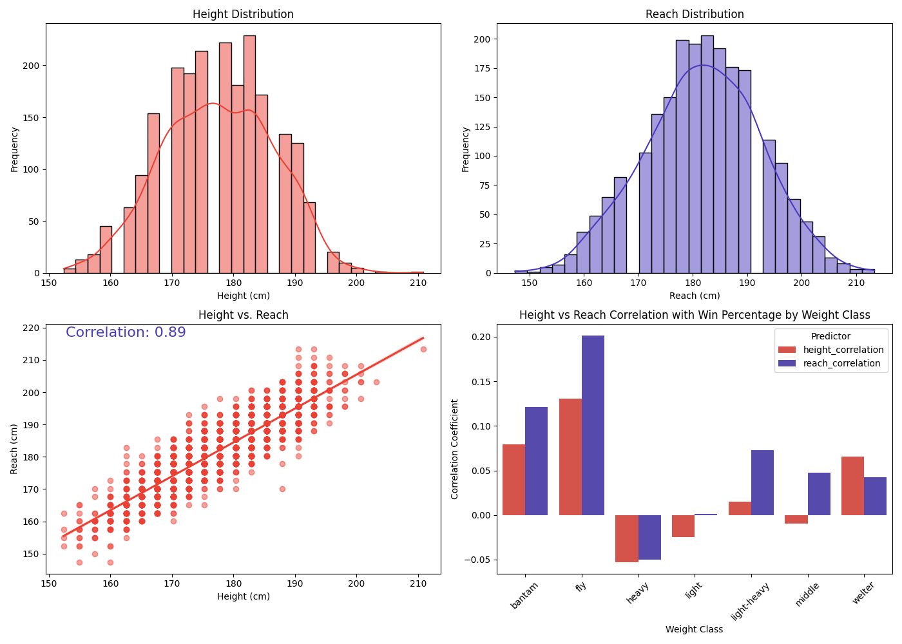
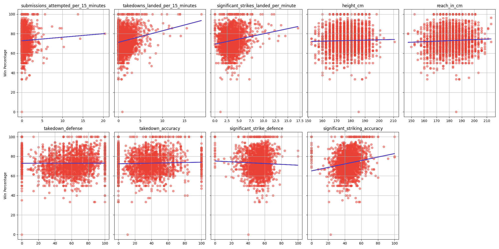
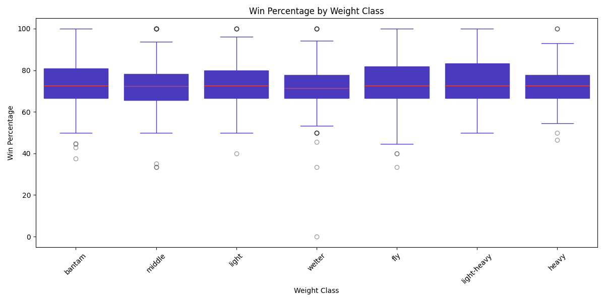

# UFC Fighter Success Factors

---

Author: Mats J Funke

## Motivation and Goal of the project

I've always been intrigued by the factors that influence a fighter's chances of winning a match, whether it's their physical attributes like height and reach, or their fighting style, such as grappling or striking.
Through this data analysis, I aim to uncover insights and answers to these intriguing questions.

# Dataset

I'm conducting my analysis on the
[UFC Fighters' Statistics Dataset from Kaggle](https://www.kaggle.com/datasets/asaniczka/ufc-fighters-statistics).

The overall data quality is generally good, as it's fairly recent and up to date.
However, there were a few rows with missing values that I needed to remove.
I would have appreciated having a gender column in the dataset, but unfortunately, the underlying data is sourced from UFCStats.com, which does not provide gender information.
Fortunately, this shouldn't be a significant issue, as I've categorized the fighters by their weight classes, which will help maintain the analysis's relevance.

# Questions

### 1. What is the degree of correlation between height and reach, and which is a more significant factor for winning: height or reach?



The plot above demonstrates that both height and reach are approximately normally distributed, and they exhibit a high correlation coefficient of 0.89, indicating a strong linear dependency between the two variables.

Interestingly, for nearly all weight classes (6 out of 7), having a longer reach is a more reliable predictor of winning than simply being tall.
Especially in the bantamweight, flyweight, middleweight, and light-heavyweight divisions, a longer reach shows a strong correlation with the likelihood of winning.
In contrast, in the welterweight class, simply being taller is more advantageous for winning.

### 2. Out of all features which is the biggest predictor of fighting Success?



The linear regression lines generally have shallow slopes, indicating weak correlations between the features and win percentage.
Although features like "takedowns landed per 15 minutes" & "significant strikes landed per minute" display a slight positive trend, none serve as strong standalone predictors of win percentage.
The wide scatter of data points around the regression lines suggests significant variability not explained by these features alone.
A more comprehensive model that includes multiple factors might be necessary for better prediction of success.

R^2 Explanation: An R^2 value close to 0 suggests that the feature does not contribute significantly to predicting the outcome. In this case, all features have values near 0, indicating they are poor standalone predictors of win percentage.

```sh
submissions_attempted_per_15_minutes: R^2 = 0.00
takedowns_landed_per_15_minutes: R^2 = 0.03
significant_strikes_landed_per_minute: R^2 = 0.03
height_cm: R^2 = 0.00
reach_in_cm: R^2 = 0.00
takedown_defense: R^2 = 0.00
takedown_accuracy: R^2 = 0.00
significant_strike_defence: R^2 = 0.00
significant_striking_accuracy: R^2 = 0.03
```

### 3. How do win percentages vary across different weight classes, and are there significant outliers in performance within each class?



The boxplot provides insights into how win percentages vary across different weight classes and highlights any significant outliers:
Most weight classes have a median win percentage around 70-80%. This central tendency suggests a generally high level of performance across classes.
The interquartile range (IQR) is similar across classes, indicating consistent variability in win percentages.
Each weight class shows some outliers, indicated by the points outside the whiskers, outliers represent fighters with significantly lower or higher win percentages compared to their peers in the same class.

While the medians are similar, there are slight differences in range and outlier distribution, which could indicate **varying competitiveness** across classes.
Overall, the boxplot suggests a generally consistent performance level across weight classes, with some individual outliers in each class.

# Conclusion

The analysis demonstrates that while certain physical attributes and fighting styles have some impact on a fighter's success, no single factor serves as a strong predictor.
The findings suggest the need for more complex models to better understand and predict UFC fight outcomes.

### Suggestions for Further Analysis:

**Incorporate Additional Data**: Consider integrating more variables, such as fight history, training regimen, or psychological factors, to enhance the predictive model.
**Explore Non-Linear Models**: Since linear regression shows weak correlations, exploring non-linear model

# Repo Structure & Usage

**Filetree**:

```sh
├── README.md                              # documentation
├── app.py                                 # streamlit dashboard
├── general_importance_plot.py             # plot of linear regressions applied to all important columns
├── height_reach_plot.py                   # plot aout height and reach correlation and thier correlation with win percentage
├── main.py                                # main entrypoint and pandas data wrangling
├── plots                                  # plots get saved here
│   ├── features_linear_regression.png
│   ├── height_reach_plot.png
│   └── win_weightclass_boxplot.png
├── requirements.txt                       # dependencies
├── ufc-fighters-statistics.csv            # dataset CSV
└── win_weightclass_boxplot.py             # plot of win percentage in differen weight classes
```

**Running Scripts**:

```sh
# install dependencies
python -m venv venv
source venv/bin/activate

# process data and to view plots uncommit the docstring
python main.py

# view streamlit dashboard
streamlit run app.py
```
